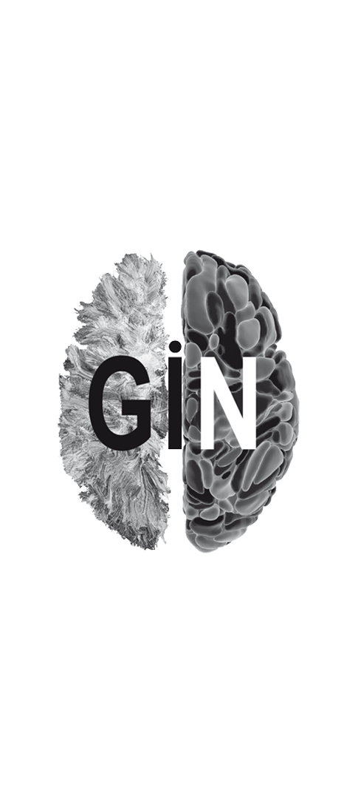

# Cerebral Microbleeds (CMB) segmentation with a 3D Unet

This repository contains the trained tensorflow models for the 3D Segmentation of Cerebral Microbleeds on SWI MR Images with a 3D U-Shaped Neural Network (U-net) as described in a forthcoming scientific publication.


## IP, Licencing & Usage

**The inferences created by these models should not be used for clinical purposes.**

The segmentation models in this repository have been registered at the french 'Association de Protection des Programmes' under the number: 
[IDDN.FR.001.240015.000.S.P.2022.000.31230](https://secure.app.asso.fr/app.server/certificate/?sn=2023420007000&key=b6111d4ba322d83ad2a19f8c09b83da5c23ce23c873a5a99fd9e2892be635da1&lang=fr). 

The segmentation models in this repository are provided under the Creative Common Licence [BY-NC-SA](https://creativecommons.org/licenses/by-nc-sa/4.0/).


## The segmentation models
The models were trained with SWI images with a size of 160 × 214 × 176 x 1 voxels. The training was done with images with an isotropic voxel size of 1 × 1 × 1 mm3 and with normalized voxel values in [0, 1] (min-max normalization with the max set to the 99th percentile of the brain voxel values to avoid "hot spots"). The brain is supposed to be centered, the models are trained with and without a brain mask applied on images. This model can also be used with T2*Gre images.

The segmentation can be computed as the average of the inference of several models (depending on the number of folds used in the training for a particular model). The resulting segmentation is an image with voxels values in [0, 1] (proxy for the probability of detection of WMH) that must be thresholded to get the actual segmentation. A threshold of 0.5 has been used successfully but that depends on the preferred balance between precision and sensitivity.

* The segmentation models described in the publication
    * due to file size limitation the models can be found [here](https://cloud.efixia.com/sharing/mb4gM77BK) https://cloud.efixia.com/sharing/mb4gM77BK
    * Checksum : 998ab737afc83ae48a193803c50cf3de
    * JSON file for SHiVAi pipeline: [model_info_swi-cmb-v1.json](model_info_swi-cmb-v1.json)

## Requirements
The models were trained with Tensorflow >= 2.7 used with Python 3.7, they are stored in the H5 format (there is a compatibility problem when reading tendorflow H5 files by using Python version > 3.7).

A NVIDIA GPU with at least 9Go of RAM is needed to compute inferences with the trained models.

To run the `predict_one_file.py` script, you will need a python environment with the following librairies:
- tensorflow >= 2.7
- numpy
- nibabel

If you don't know anything about python environment and libraries, you can find some documentation and installers on the [Anaconda website](https://docs.anaconda.com/). We recommend using the lightweight [Miniconda](https://docs.anaconda.com/miniconda/).

## Usage
**These models can be used with the [SHiVAi](https://github.com/pboutinaud/SHiVAi) preprocessing and deep learning segmentation workflow.**

### Step-by-step process to run the model without SHiVAi
1. Download the `predict_one_file.py` from the repository (clic the "<> Code" button on the GitHub interface and download the zip file, or clone the repository)
2. Download and unzip the trained models (see [above](#the-segmentation-models))
3. Preprocess the input data (swi or T2gre images) to the proper x-y-z volume (160 × 214 × 176). If the resolution is close to 1mm isotropic voxels, a simple cropping is enough. Otherwise, you will have to resample the images to 1mm isotropic voxels. For now, you will have to do it by yourself, but soon we will provide a full Shiva pipeline to run everything.
4. Run the `predict_one_file.py` script as described below

To run `predict_one_file.py` in your python environment you can check the help with the command `python predict_one_file.py -h` (replace "predict_one_file.py" with the full path to the script if it is not in the working directory).

Here is an example of usage of the script with the following inputs:
- The `predict_one_file.py` script stored in `/myhome/my_scripts/`
- Preprocessed Nifti images (volume shape must be 160 × 214 × 176 and voxel values between 0 and 1) stored (for the example) in the folder `/myhome/mydata/`
- The CMB AI models stored (for the example) in `/myhome/cmb_models/v1`
- The ouput folder (for the example) `/myhome/my_results` needs to exist at launch

```bash
python /myhome/my_scripts/predict_one_file.py -i /myhome/mydata/swi_image.nii.gz -b /myhome/mydata/input_brainmask.nii.gz -o /myhome/my_results/cmb_segmentation.nii.gz -m /myhome/cmb_models/v1/20230330-095525_Unet3Dv2-10.7.2-1.8-SWAN.CMB_fold_CMB_1x3-331_fold_1_model.h5 -m /myhome/cmb_models/v1/20230329-221948_Unet3Dv2-10.7.2-1.8-SWAN.CMB_fold_CMB_1x3-331_fold_2_model.h5 -m /myhome/cmb_models/v1/20230328-101347_Unet3Dv2-10.7.2-1.8-SWAN.CMB_fold_CMB_1x3-331_fold_0_model.h5 
```
>Note that the brain mask input here with `-b /myhome/mydata/input_brainmask.nii.gz` is optional

### Building your own script
The provided python script `predict_one_file.py` can be used as is for running the model or can be used an example to build your own script.

Here is the main part of the script, assuming that the images are in a numpy array with the correct shape (*nb of images*, 160, 214, 176, *number of modality to use for this model*) and you have enough CPU RAM to load all images in one array (else use a Tensorflow dataset) :
````python
# Load models & predict
predictions = []
for predictor_file in predictor_files:  # predictor_files is the list of the model's paths
    tf.keras.backend.clear_session()
    try:
        model = tf.keras.models.load_model(
            predictor_file,
            compile=False,
            custom_objects={"tf": tf})
    except Exception as err:
        print(f'\n\tWARNING : Exception loading model : {predictor_file}\n{err}')
        continue
    # compute the segmentation for this model
    prediction = model.predict(images)
    # append segmentation for this
    predictions.append(prediction)

# Average all predictions
predictions = np.mean(predictions, axis=0)
````

## Acknowledgements
This work has been done in collaboration between the [Fealinx](http://www.fealinx-biomedical.com/en/) company and the [GIN](https://www.gin.cnrs.fr/en/) laboratory (Groupe d'Imagerie Neurofonctionelle, UMR5293, IMN, Univ. Bordeaux, CEA , CNRS) with grants from the Agence Nationale de la Recherche (ANR) with the projects [GinesisLab](http://www.ginesislab.fr/) (ANR 16-LCV2-0006-01) and [SHIVA](https://rhu-shiva.com/en/) (ANR-18-RHUS-0002)

||||||
|---|---|---|---|---|

