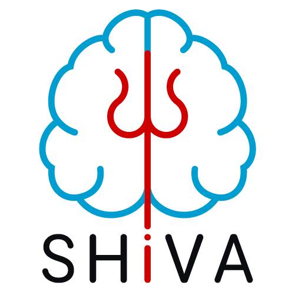

# Cerebral Microbleeds (CMB) segmentation with a 3D Unet

This repository contains the trained tensorflow models for the 3D Segmentation of Cerebral Microbleeds on SWI MR Images with a 3D U-Shaped Neural Network (U-net) as described in a forthcoming scientific publication.

## IP, Licencing & Usage

**The inferences created by these models should not be used for clinical purposes.**

The segmentation models in this repository have been registered at the french 'Association de Protection des Programmes' under the number:

[IDDN.FR.001.240015.000.S.P.2022.000.31230](https://secure.app.asso.fr/app.server/certificate/?sn=2023420007000&key=b6111d4ba322d83ad2a19f8c09b83da5c23ce23c873a5a99fd9e2892be635da1&lang=fr). 

The segmentation models in this repository are provided under the Creative Common Licence [BY-NC-SA](https://creativecommons.org/licenses/by-nc-sa/4.0/).

## The segmentation models
The models were trained with SWI images with a size of 160 × 214 × 176 x 1 voxels. The training was done with images with an isotropic voxel size of 1 × 1 × 1 mm3 and with normalized voxel values in [0, 1] (min-max normalization with the max set to the 99th percentile of the brain voxel values to avoid "hot spots"). The brain is supposed to be centered, the models are trained with and without a brain mask applied on images.
This model can also be used with T2*Gre images.

A segmentation can be computed as the average of the inference of several models (depending on the number of folds used in the training for a particular model).
<!-- -->
* The segmentation model described in the publication
    * due to file size limitation the models can be found [here](https://cloud.efixia.com/sharing/mb4gM77BK) :https://cloud.efixia.com/sharing/mb4gM77BK
    * Checksum : 998ab737afc83ae48a193803c50cf3de

The resulting segmentation is an image with voxels values in [0, 1] (proxy for the probability of detection of WMH) that must be thresholded to get the final segmentation. A threshold of 0.5 has been used successfully but that depends on the preferred balance between precision and sensitivity.

## Requirements
The models were trained with Tensorflow >= 2.7 used with Python 3.7, they are stored in the H5 format (there is a compatibility problem when reading tendorflow H5 files by using Python version > 3.7).

The provided python script *predict_one_file.py* can be used as an example of usage of the model. It needs the *nibabel* python library to be able to read NIfTI files. 

A NVIDIA GPU with at least 9Go of RAM is needed to compute inferences with the trained models.

## Acknowledgements
This work has been done in collaboration between the [Fealinx](http://www.fealinx-biomedical.com/en/) company and the [GIN](https://www.gin.cnrs.fr/en/) laboratory (Groupe d'Imagerie Neurofonctionelle, UMR5293, IMN, Univ. Bordeaux, CEA , CNRS) with grants from the Agence Nationale de la Recherche (ANR) with the projects [GinesisLab](http://www.ginesislab.fr/) (ANR 16-LCV2-0006-01) and [SHIVA](https://rhu-shiva.com/en/) (ANR-18-RHUS-0002)

||||||
|---|---|---|---|---|

